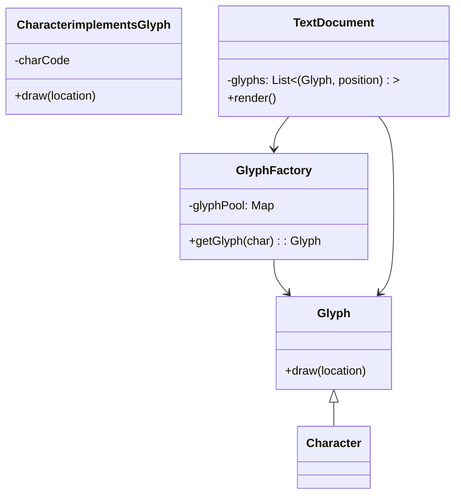

Маш гоё асуултууд байна! Энэ удаа Flyweight загварын **гол бүрэлдэхүүнүүд**, **UML бүтэц**, **бодит жишээ**, **имплементаци**, мөн аль framework-ууд ашигладаг талаар нарийвчлан хариулъя. Бүх хариулт монгол хэл дээр, шаардлагатай бол англи нэршлийг хавсаргав:

---

## 🔹 **6. Flyweight Design Pattern-ийн гол бүрэлдэхүүнүүд юу вэ?**

Flyweight загвар нь дараах **5 үндсэн бүрэлдэхүүн хэсгээс** бүрддэг:

1. **Flyweight (interface / abstract class)**  
   – Хуваалцагдах обьектын ерөнхий интерфэйс.  
   – `operation(extrinsicState)` зэрэг аргууд агуулна.

2. **ConcreteFlyweight (бодит хэрэгжүүлэлт)**  
   – Flyweight interface-ийг хэрэгжүүлнэ.  
   – **Intrinsic state**-г хадгална (дундын өгөгдөл).

3. **UnsharedConcreteFlyweight (хуваалцагдахгүй хувилбар)**  
   – Хуваалцагдахгүй, тусгай тохиолдолд хэрэглэгдэнэ.

4. **FlyweightFactory (үйлдвэрлэгч)**  
   – Flyweight обьектийг **cache**-д хадгалж, дахин ашиглах боломж олгоно.  
   – Өмнө нь байсан обьектийг буцаана, эсвэл шинээр үүсгэнэ.

5. **Client (хэрэглэгч код)**  
   – Flyweight обьектуудыг хэрэглэнэ.  
   – **Extrinsic state**-г гаднаас өгнө.

---

## 🔹 **7. Flyweight Pattern-ийн UML бүтэц ба амьдрал дээрх жишээ**

### UML диаграм:

```
   +-------------------+
   |     Flyweight     |<-------------------------+
   | + operation()     |                          |
   +-------------------+                          |
             ^                                     |
             |                                     |
   +-------------------------+           +---------------------------+
   |   ConcreteFlyweight     |           | FlyweightFactory          |
   | + intrinsicState        |           | - flyweights: Map         |
   | + operation(extrinsic)  |           | + getFlyweight(key)       |
   +-------------------------+           +---------------------------+
                                                  ^
                                                  |
                                        +------------------------+
                                        |        Client          |
                                        | - uses flyweights      |
                                        +------------------------+
```

---

### ✅ **Бодит амьдрал дахь UML жишээ — “Font Glyphs in Text Editor”**



---

## 🔹 **8. Flyweight Pattern-ийг Python хэлээр хэрэгжүүлэх жишээ**

```python
# Flyweight (interface)
class TreeType:
    def __init__(self, name, color, texture):
        self.name = name
        self.color = color
        self.texture = texture

    def draw(self, x, y):
        print(f"Drawing {self.name} tree at ({x}, {y}) with color {self.color} and texture {self.texture}")

# FlyweightFactory
class TreeFactory:
    _tree_types = {}

    @classmethod
    def get_tree_type(cls, name, color, texture):
        key = (name, color, texture)
        if key not in cls._tree_types:
            cls._tree_types[key] = TreeType(name, color, texture)
        return cls._tree_types[key]

# Client
class Tree:
    def __init__(self, x, y, tree_type):
        self.x = x
        self.y = y
        self.tree_type = tree_type

    def draw(self):
        self.tree_type.draw(self.x, self.y)

# Usage
if __name__ == "__main__":
    trees = []
    factory = TreeFactory()

    for i in range(1000000):
        tree_type = factory.get_tree_type("Oak", "Green", "Rough")
        trees.append(Tree(i, i, tree_type))

    trees[0].draw()
```

✅ Энэ кодын хувьд:
- **TreeType** бол Flyweight.
- **TreeFactory** бол FlyweightFactory.
- **Tree** нь обьектоороо олон боловч **TreeType**-аар дамжин нэг shared state-тай байна.

---

## 🔹 **9. Flyweight загварыг хэрэгжүүлэх өөр хувилбарууд байдаг уу?**

Тийм ээ, хэд хэдэн **альтернатив арга** байдаг:

1. **Enum + static pool** ашиглах:
   - Жишээ нь, Java хэлэнд `enum`-ууд Flyweight шиг үйлчилдэг.

2. **Object Pool Pattern**-тэй хослуулах:
   - Obьектийг дахин ашиглах зорилгоор memory pool ашиглана.

3. **Dependency Injection (DI)**-тэй хослох:
   - Flyweight-ийг DI container-аар удирдах.

4. **Memory-mapped Flyweights (Zero-copy techniques)**:
   - C/C++-д raw memory structure дээрээс obьект үзүүлж flyweight үүсгэх.

---

## 🔹 **10. Аль framework, library-ууд Flyweight Pattern ашигладаг вэ?**

### ✅ **Java AWT / Swing**
- `Font`, `Color`, `Icon` зэрэг объектууд Flyweight хэлбэрээр caching хийдэг.

### ✅ **.NET Framework**
- `Brush`, `Pen`, `StringFormat` гэх мэт `System.Drawing` обьектуудыг Flyweight маягаар дахин ашигладаг.

### ✅ **Unity Game Engine**
- Олон тооны prefab/game object-уудыг memory efficient байдлаар хандахдаа flyweight санааг ашигладаг.

### ✅ **Web Browsers**
- DOM элементүүдийн стиль, layout-г дахин ашиглах замаар flyweight үйлдэл хийдэг.

### ✅ **Database Connection Pool**
- Техникийн хувьд өөр pattern (object pool) боловч flyweight санааг хамт хэрэглэдэг.

---

Хэрвээ чи тодорхой framework (жишээ нь Django, React, Spring г.м.) дээр хэрэгжүүлсэн жишээ сонирхож байвал би нарийвчилж авч үзэж болно шүү! 😊  
Дараагийн асуулт байгаа бол үргэлжлүүлээд асуугаарай!